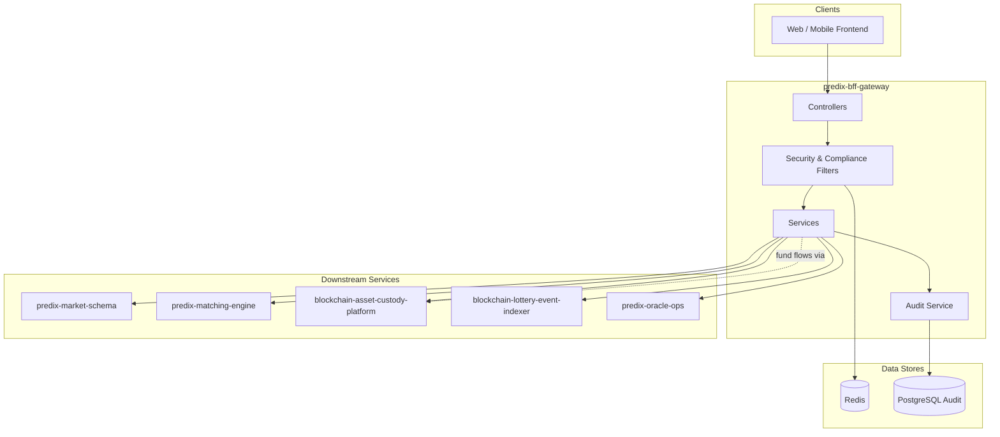

# predix-bff-gateway

> Production-grade Backend-for-Frontend (BFF) gateway for a Web3 prediction-market platform — built with Java 21 and Spring Boot 3.4.

A unified API edge that aggregates five downstream microservices, implements Sign-In with Ethereum (SIWE) wallet authentication, enforces geo-compliance and KYC policies, and ships with automated CI, Docker deployment, and **76.9% line coverage** across 36 automated tests.

---

## Why This Project Matters

Modern fintech and Web3 products need more than CRUD APIs. They require:

| Challenge | How this project addresses it |
|-----------|-------------------------------|
| Multiple backend services | Single BFF orchestrates market, matching, custody, indexer, and oracle services |
| Wallet-based auth | Full SIWE (EIP-4361) flow with nonce, signature verification, JWT + Redis sessions |
| Regulatory compliance | GeoIP-based mainland China blocking, KYC gating, audit trail to PostgreSQL |
| Fund safety | `CustodyPathGuard` ensures all deposit/withdraw/balance calls route exclusively through BACP |
| Production readiness | Resilience4j retries, Prometheus metrics, structured error codes, Flyway migrations, CI pipeline |

This codebase demonstrates end-to-end backend engineering — from security and compliance to observability and test-driven quality gates.

---

## Highlights (Portfolio Summary)

| Area | Deliverable |
|------|-------------|
| **Architecture** | Layered BFF (controller → service → client) with policy enforcement at the edge |
| **Security** | SIWE wallet login, JWT sessions, Redis nonce (one-time, TTL 5 min), IP rate limiting |
| **Compliance** | MaxMind GeoIP2 + CN heuristic fallback; 100% CN block; KYC gate on trading endpoints |
| **Resilience** | WebClient with timeout/retry (Resilience4j); unified downstream error mapping |
| **Observability** | Micrometer metrics, distributed `X-Trace-Id`, Actuator health + Prometheus |
| **Quality** | 14 test classes · 36 test cases · JaCoCo ≥ 75% enforced · GitHub Actions CI |
| **Deployment** | Multi-stage Docker image (Eclipse Temurin 21 JRE Alpine), docker-compose for local deps |

---

## Tech Stack

| Layer | Technology |
|-------|------------|
| Runtime | Java 21, Spring Boot 3.4.5 |
| Security | Spring Security, SIWE (web3j 4.12), JWT (JJWT 0.12) |
| Data | Redis (sessions, nonce, rate limit), PostgreSQL + Flyway (audit log) |
| HTTP | Spring WebClient, Resilience4j 2.3 |
| API docs | SpringDoc OpenAPI 2.8 |
| Testing | JUnit 5, Mockito, MockWebServer, jedis-mock, Spring MockMvc |
| CI / Quality | GitHub Actions, JaCoCo, OWASP dependency check (CVSS ≥ 7 fails build) |

---

## Architecture



### Layer Responsibilities

| Package | Responsibility |
|---------|----------------|
| `controller` | REST API, request validation, OpenAPI annotations |
| `service` | Business orchestration, KYC gate, custody path guard |
| `client` | Downstream HTTP calls with timeout, retry, error translation |
| `security` | SIWE verification, JWT, session management, rate limiting |
| `compliance` | GeoIP resolution, CN block filter, country policy hooks |
| `audit` | Async structured audit events persisted to PostgreSQL |
| `exception` | Unified `ErrorCode` enum and global exception handler |

See [docs/architecture.md](docs/architecture.md) for observability metrics and data-store details.

---

## API Reference

Base path: `/api/v1`

### Authentication

| Method | Path | Auth | Description |
|--------|------|------|-------------|
| `GET` | `/auth/siwe/nonce` | Public | Issue a one-time SIWE nonce |
| `POST` | `/auth/siwe/verify` | Public | Verify wallet signature and issue JWT |
| `POST` | `/auth/logout` | Bearer | Invalidate session |
| `GET` | `/auth/me` | Bearer | Return current user profile |

### Markets (read-only, no KYC)

| Method | Path | Auth | Description |
|--------|------|------|-------------|
| `GET` | `/markets` | Bearer | List all markets |
| `GET` | `/markets/{id}` | Bearer | Get market detail (enriched) |
| `GET` | `/markets/{id}/orderbook` | Bearer | Get order book |
| `GET` | `/markets/{id}/positions` | Bearer | Get user positions |

### Orders (KYC required)

| Method | Path | Auth | Description |
|--------|------|------|-------------|
| `POST` | `/orders` | Bearer + KYC | Place an order |
| `POST` | `/orders/{id}/cancel` | Bearer + KYC | Cancel an order |

### Custody (KYC required, BACP-only)

| Method | Path | Auth | Description |
|--------|------|------|-------------|
| `POST` | `/custody/deposits` | Bearer + KYC | Initiate deposit |
| `POST` | `/custody/withdrawals` | Bearer + KYC | Initiate withdrawal |
| `GET` | `/custody/balances` | Bearer + KYC | Query balances |

### System

| Method | Path | Auth | Description |
|--------|------|------|-------------|
| `GET` | `/system/dependencies/health` | Public | Downstream dependency health |

Interactive docs: `http://localhost:8080/swagger-ui.html`

---

## Quick Start

### Prerequisites

- JDK 21
- Maven 3.9+
- Docker (for local Redis and PostgreSQL)

### Run locally

```bash
# 1. Start infrastructure
docker compose -f docker/docker-compose.yml up -d redis postgres

# 2. Configure environment
cp .env.example .env

# 3. Build and run
mvn spring-boot:run -Dspring-boot.run.profiles=dev
```

Or use the convenience script:

```bash
chmod +x scripts/start-local.sh
./scripts/start-local.sh
```

### Service URLs

| Endpoint | URL |
|----------|-----|
| API base | `http://localhost:8080` |
| Swagger UI | `http://localhost:8080/swagger-ui.html` |
| Health | `http://localhost:8080/actuator/health` |
| Prometheus | `http://localhost:8080/actuator/prometheus` |

### Docker build

```bash
mvn package -DskipTests
docker build -t predix-bff-gateway:latest .
docker run -p 8080:8080 --env-file .env predix-bff-gateway:latest
```

---

## Configuration

| Variable | Description |
|----------|-------------|
| `REDIS_HOST` | Redis host for sessions, SIWE nonces, and rate limiting |
| `DATABASE_URL` | PostgreSQL JDBC URL for audit logs |
| `JWT_SECRET` | JWT signing secret (rotate in production) |
| `JWT_ACCESS_TTL` | Access token TTL (default `PT24H`) |
| `SIWE_DOMAIN` / `SIWE_URI` | SIWE message domain and URI |
| `RATE_LIMIT_RPM` | Requests per minute per IP (default 120) |
| `GEOIP_DB_PATH` | MaxMind GeoLite2 Country database path |
| `MARKET_SCHEMA_URL` | predix-market-schema service URL |
| `MATCHING_URL` | predix-matching-engine service URL |
| `BACP_URL` | blockchain-asset-custody-platform service URL |
| `INDEXER_URL` | blockchain-lottery-java-event-indexer service URL |
| `ORACLE_OPS_URL` | predix-oracle-ops service URL |

Full list: [.env.example](.env.example)

---

## API Examples

### 1. Request a SIWE nonce

```bash
curl -s http://localhost:8080/api/v1/auth/siwe/nonce | jq
```

### 2. Verify signature and authenticate

```bash
curl -s -X POST http://localhost:8080/api/v1/auth/siwe/verify \
  -H 'Content-Type: application/json' \
  -d '{
    "walletAddress": "0x...",
    "message": "...",
    "signature": "0x...",
    "chainId": 1
  }' | jq
```

### 3. Access protected resources

```bash
TOKEN="<accessToken>"
curl -s http://localhost:8080/api/v1/auth/me \
  -H "Authorization: Bearer $TOKEN" | jq
```

### 4. List markets

```bash
curl -s http://localhost:8080/api/v1/markets \
  -H "Authorization: Bearer $TOKEN" | jq
```

### 5. Initiate a deposit (BACP only)

```bash
curl -s -X POST http://localhost:8080/api/v1/custody/deposits \
  -H "Authorization: Bearer $TOKEN" \
  -H 'Content-Type: application/json' \
  -d '{"userId":"u1","amount":"100","asset":"USDC"}' | jq
```

---

## Compliance & Security

### Geo-compliance

- Client IP resolved from `CF-Connecting-IP` → `X-Forwarded-For` (first hop) → `X-Real-IP`
- Country lookup via MaxMind GeoIP2 (`GEOIP_DB_PATH`) with built-in CN heuristic fallback
- Mainland China (CN) IPs are **100% blocked** → `COMPLIANCE_CN_BLOCKED` (403)
- Trading endpoints require `KYC=APPROVED`; market browsing does not

### Security controls

- SIWE nonce: one-time use, 5-minute TTL in Redis
- Stateless JWT filter chain; session revocation via Redis
- Jakarta Validation on all request DTOs; strict `0x[a-fA-F0-9]{40}` wallet pattern
- Redis sliding-window rate limit per client IP
- `CustodyPathGuard` blocks fund operations outside BACP client context

Details: [docs/security.md](docs/security.md) · [docs/compliance.md](docs/compliance.md)

---

## Error Codes

| Code | HTTP | Description |
|------|------|-------------|
| `AUTH_INVALID_SIGNATURE` | 401 | SIWE signature verification failed |
| `AUTH_NONCE_EXPIRED` | 401 | Nonce expired or already consumed |
| `AUTH_INVALID_TOKEN` | 401 | Invalid token or expired session |
| `COMPLIANCE_CN_BLOCKED` | 403 | Request blocked — mainland China IP |
| `COMPLIANCE_KYC_REQUIRED` | 403 | KYC approval required |
| `CUSTODY_PATH_VIOLATION` | 403 | Fund operation did not route through BACP |
| `DOWNSTREAM_UNAVAILABLE` | 502 | Downstream service unavailable |
| `DOWNSTREAM_TIMEOUT` | 504 | Downstream service timeout |
| `RATE_LIMIT_EXCEEDED` | 429 | Global rate limit exceeded |

---

## Testing & Quality Assurance

### Summary

| Metric | Value |
|--------|-------|
| Test classes | 14 |
| Test cases | 36 |
| Line coverage | **76.9%** (496 / 645 lines) |
| Coverage gate | ≥ 75% (enforced by JaCoCo in `mvn verify`) |
| Integration tests | 7 end-to-end scenarios via `@SpringBootTest` + MockMvc |
| CI pipeline | GitHub Actions — build, test, coverage, Docker, OWASP scan |

### Run tests

```bash
# Full verify (unit + integration + coverage gate)
mvn verify

# Unit tests only
mvn test

# View coverage report
open target/site/jacoco/index.html
```

### Test Suite Breakdown

#### Unit Tests — Security

| Test Class | Test Case | What It Validates |
|------------|-----------|-------------------|
| `NonceServiceTest` | `generateNonce_storesInRedisWithTtl` | Nonce is persisted in Redis with correct TTL |
| | `consumeNonce_deletesKey` | Successful nonce consumption removes the key |
| | `consumeNonce_missingThrows` | Missing/expired nonce throws `AUTH_NONCE_EXPIRED` |
| `SiweVerifierTest` | `extractNonce_parsesMessage` | Nonce extraction from SIWE message body |
| | `verify_validSignature` | Valid ECDSA signature passes verification |
| | `verify_invalidSignatureThrows` | Invalid signature throws `AUTH_INVALID_SIGNATURE` |
| `JwtTokenProviderTest` | `createAndParseToken` | JWT creation and round-trip parsing |
| | `invalidTokenThrows` | Malformed token rejected |

#### Unit Tests — Compliance

| Test Class | Test Case | What It Validates |
|------------|-----------|-------------------|
| `ComplianceServiceTest` | `blocksMainlandChina` | CN country code triggers compliance block |
| | `kycRequiredForTrading` | Trading paths require `KYC=APPROVED` |
| | `allowsReadWithoutKyc` | Market read endpoints accessible without KYC |
| `IpExtractorTest` | `prefersCfConnectingIp` | Cloudflare header takes priority |
| | `parsesXForwardedForFirstHop` | First hop of XFF chain is used |
| `CnIpHeuristicsTest` | `detectsKnownCnTestIp` | Built-in CN IP heuristic matches known ranges |
| | `unknownIpReturnsEmpty` | Unknown IPs return no country hint |

#### Unit Tests — Services

| Test Class | Test Case | What It Validates |
|------------|-----------|-------------------|
| `AuthServiceTest` | `createNonce_returnsMessageWithNonceAndWallet` | SIWE message includes nonce and wallet address |
| | `verify_invalidSignatureFails` | Bad signature rejected at service layer |
| `MarketServiceTest` | `listMarkets` | Market list aggregation from downstream |
| | `getMarket_enriched` | Single market detail enrichment |
| | `getOrderbook` | Order book proxy to matching engine |
| | `getPositions` | Position data retrieval |
| `OrderServiceTest` | `placeOrder_requiresKyc` | Order placement blocked without KYC |
| | `placeOrder_success` | Valid KYC session places order via matching engine |
| `CustodyServiceTest` | `depositUsesBacpOnly` | Deposits routed exclusively through BACP client |
| `CustodyPathGuardTest` | `blocksFundOpsOutsideBacpContext` | Fund ops outside BACP context throw violation |
| | `allowsInsideBacpContext` | Fund ops succeed within BACP context |

#### Unit Tests — Infrastructure

| Test Class | Test Case | What It Validates |
|------------|-----------|-------------------|
| `DownstreamClientTest` | `getMarkets_success` | Successful downstream HTTP call and response mapping |
| | `getMarkets_unavailable` | Downstream failure mapped to `DOWNSTREAM_UNAVAILABLE` |
| `GlobalExceptionHandlerTest` | `handlesBffException` | Structured error response for `BffException` |

#### Integration Tests — End-to-End

| Test Class | Test Case | What It Validates |
|------------|-----------|-------------------|
| `BffIntegrationTest` | `nonceEndpointPublic` | Nonce endpoint accessible without auth |
| | `protectedEndpointWithoutTokenReturns401` | Protected routes reject unauthenticated requests |
| | `cnIpBlocked` | CN IP header triggers 403 compliance block |
| | `authenticatedMeWithValidSession` | Valid JWT returns user profile on `/auth/me` |
| | `custodyRequiresKyc` | Custody deposit blocked when KYC not approved |
| | `marketsListRequiresAuth` | Market list requires Bearer token |
| | `downstreamUnavailableMapsError` | Downstream outage returns structured 502 error |

### Test Infrastructure

| Component | Purpose |
|-----------|---------|
| `TestRedisConfig` / `TestRedisSupport` | In-memory Redis via jedis-mock |
| `RecordingAuditRecorder` | Captures audit events without PostgreSQL |
| MockWebServer (OkHttp) | Simulates downstream microservice responses |
| H2 in-memory DB | Integration test database (`application-test.yml`) |

### CI Pipeline

```yaml
# .github/workflows/ci.yml
- Maven verify (unit + integration)
- JaCoCo coverage gate: ≥ 75%
- Docker image build
- OWASP dependency check (fail on CVSS ≥ 7)
```

---

## Project Structure

```
predix-bff-gateway/
├── src/main/java/com/predix/bff/
│   ├── controller/          # REST endpoints (auth, market, order, custody, system)
│   ├── service/             # Orchestration, KYC gate, custody path guard
│   ├── client/              # WebClient downstream adapters (5 services)
│   ├── security/            # SIWE, JWT, session, rate limit, Spring Security config
│   ├── compliance/          # GeoIP, CN block filter, IP extraction
│   ├── audit/               # Async audit logging to PostgreSQL
│   ├── config/              # Redis, WebClient, metrics, OpenAPI, properties
│   ├── dto/                 # Request/response models
│   └── exception/           # ErrorCode enum, global handler
├── src/test/java/           # 14 test classes (unit + integration)
├── src/main/resources/
│   ├── application.yml      # Base configuration
│   ├── application-dev.yml  # Local dev profile
│   └── db/migration/        # Flyway SQL migrations
├── docker/docker-compose.yml
├── docs/                    # architecture, security, compliance
├── scripts/start-local.sh
├── Dockerfile
└── .github/workflows/ci.yml
```

---

## Skills Demonstrated

This project showcases capabilities relevant to **backend engineering**, **fintech/Web3**, and **platform/API gateway** contracts:

- **API Gateway / BFF pattern** — aggregation, routing, policy enforcement at the edge
- **Web3 authentication** — SIWE (EIP-4361) wallet login with cryptographic signature verification
- **Security engineering** — JWT sessions, nonce replay protection, rate limiting, input validation
- **Regulatory compliance** — GeoIP blocking, KYC gating, immutable audit trail
- **Microservice integration** — WebClient, circuit-breaker-ready patterns, unified error model
- **Observability** — Prometheus metrics, trace IDs, structured logging
- **Test-driven delivery** — layered unit tests, integration tests, enforced coverage gates
- **DevOps** — Docker, docker-compose, GitHub Actions CI with security scanning

---

## Documentation

- [Architecture](docs/architecture.md) — layers, data stores, metrics
- [Security](docs/security.md) — auth flow, rate limiting, production checklist
- [Compliance](docs/compliance.md) — CN block policy, KYC gates, headers

---

## License

Portfolio / demonstration project. Contact the author for licensing or collaboration inquiries.
