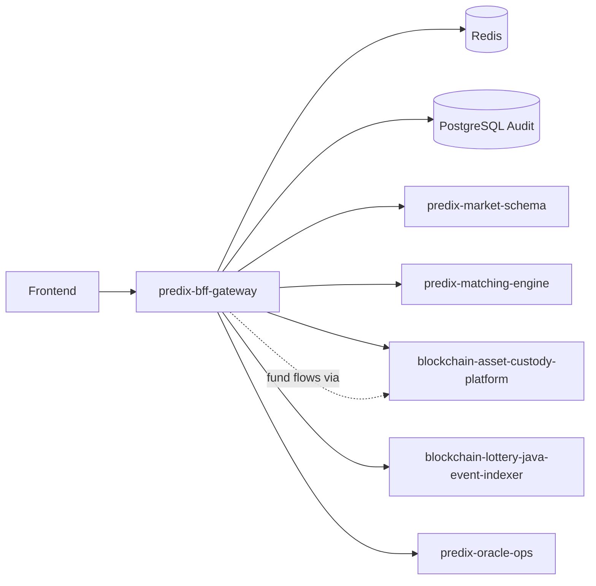

# predix-bff-gateway

Unified Backend-for-Frontend (BFF) gateway for the PrediX platform. This service aggregates downstream APIs, handles Sign-In with Ethereum (SIWE) wallet authentication, enforces geo-compliance policies, and orchestrates calls to internal microservices.

## Features

- **API aggregation** — Single entry point for frontend clients; routes requests to market, matching, custody, indexer, and oracle services.
- **SIWE authentication** — Nonce-based wallet login with JWT session management backed by Redis.
- **Compliance enforcement** — GeoIP-based access control with mainland China (CN) blocking and KYC gating on trading endpoints.
- **Custody path guard** — Ensures all fund-related operations are routed exclusively through BACP.
- **Observability** — Prometheus metrics, structured audit logging, and distributed trace IDs.

## Tech Stack

| Component | Technology |
|-----------|------------|
| Runtime | Java 21, Spring Boot 3.4 |
| Auth | SIWE (web3j), JWT (JJWT) |
| Session / cache | Redis |
| Audit store | PostgreSQL (Flyway migrations) |
| HTTP client | Spring WebClient, Resilience4j |
| API docs | SpringDoc OpenAPI |

## Prerequisites

- JDK 21
- Maven 3.9+
- Docker (optional, for local Redis and PostgreSQL)

## Quick Start

### 1. Start dependencies

```bash
docker compose -f docker/docker-compose.yml up -d redis postgres
```

### 2. Configure environment

```bash
cp .env.example .env
```

Edit `.env` as needed. See [Configuration](#configuration) below.

### 3. Run the application

```bash
mvn spring-boot:run -Dspring-boot.run.profiles=dev
```

Alternatively, use the convenience script:

```bash
chmod +x scripts/start-local.sh
./scripts/start-local.sh
```

### Endpoints

| Service | URL |
|---------|-----|
| API base | `http://localhost:8080` |
| Swagger UI | `http://localhost:8080/swagger-ui.html` |
| Health check | `http://localhost:8080/actuator/health` |
| Prometheus | `http://localhost:8080/actuator/prometheus` |

## Configuration

Key environment variables:

| Variable | Description |
|----------|-------------|
| `REDIS_HOST` | Redis host for sessions, SIWE nonces, and rate limiting |
| `DATABASE_URL` | PostgreSQL JDBC URL for audit logs |
| `JWT_SECRET` | JWT signing secret (must be rotated in production) |
| `MARKET_SCHEMA_URL` | predix-market-schema service |
| `MATCHING_URL` | predix-matching-engine service |
| `BACP_URL` | blockchain-asset-custody-platform service |
| `INDEXER_URL` | blockchain-lottery-java-event-indexer service |
| `ORACLE_OPS_URL` | predix-oracle-ops service |
| `GEOIP_DB_PATH` | Path to MaxMind GeoLite2 Country database (CN blocking) |

See [.env.example](.env.example) for the full list.

## API Examples

### 1. Request a SIWE nonce

```bash
curl -s http://localhost:8080/api/v1/auth/siwe/nonce | jq
```

### 2. Verify signature and authenticate

```bash
curl -s -X POST http://localhost:8080/api/v1/auth/siwe/verify \
  -H 'Content-Type: application/json' \
  -d '{
    "walletAddress": "0x...",
    "message": "...",
    "signature": "0x...",
    "chainId": 1
  }' | jq
```

### 3. Access protected resources

```bash
TOKEN="<accessToken>"
curl -s http://localhost:8080/api/v1/auth/me \
  -H "Authorization: Bearer $TOKEN" | jq
```

### 4. List markets

```bash
curl -s http://localhost:8080/api/v1/markets \
  -H "Authorization: Bearer $TOKEN" | jq
```

### 5. Initiate a deposit (BACP only)

```bash
curl -s -X POST http://localhost:8080/api/v1/custody/deposits \
  -H "Authorization: Bearer $TOKEN" \
  -H 'Content-Type: application/json' \
  -d '{"userId":"u1","amount":"100","asset":"USDC"}' | jq
```

## Compliance Policy

The gateway enforces geo-compliance at the edge:

- **Client IP resolution** — Extracted from `X-Forwarded-For`, `CF-Connecting-IP`, or `X-Real-IP`.
- **GeoIP lookup** — MaxMind GeoIP2 (via `GEOIP_DB_PATH`) with a built-in CN heuristic fallback.
- **Mainland China block** — All requests from CN IPs are rejected with error code `COMPLIANCE_CN_BLOCKED`.
- **KYC requirement** — Trading endpoints (`/api/v1/orders`, `/api/v1/custody`) require `KYC=APPROVED`.
- **Country priority** — Configurable via `predix.compliance.country-priority` (default: `SG > TH > MY > PH > VN > ID`).

## Architecture



For layer responsibilities and observability details, see [docs/architecture.md](docs/architecture.md).

## Error Codes

| Code | HTTP | Description |
|------|------|-------------|
| `AUTH_INVALID_SIGNATURE` | 401 | SIWE signature verification failed |
| `AUTH_NONCE_EXPIRED` | 401 | Nonce expired or already consumed |
| `AUTH_INVALID_TOKEN` | 401 | Invalid token or expired session |
| `COMPLIANCE_CN_BLOCKED` | 403 | Request blocked — mainland China IP |
| `COMPLIANCE_KYC_REQUIRED` | 403 | KYC approval required |
| `DOWNSTREAM_TIMEOUT` | 504 | Downstream service timeout |
| `DOWNSTREAM_UNAVAILABLE` | 502 | Downstream service unavailable |
| `CUSTODY_PATH_VIOLATION` | 403 | Fund operation did not route through BACP |
| `RATE_LIMIT_EXCEEDED` | 429 | Global rate limit exceeded |

## Testing

```bash
mvn verify
```

JaCoCo line coverage threshold: ≥ 75%.

## Documentation

- [Architecture](docs/architecture.md)
- [Security](docs/security.md)
- [Compliance](docs/compliance.md)
