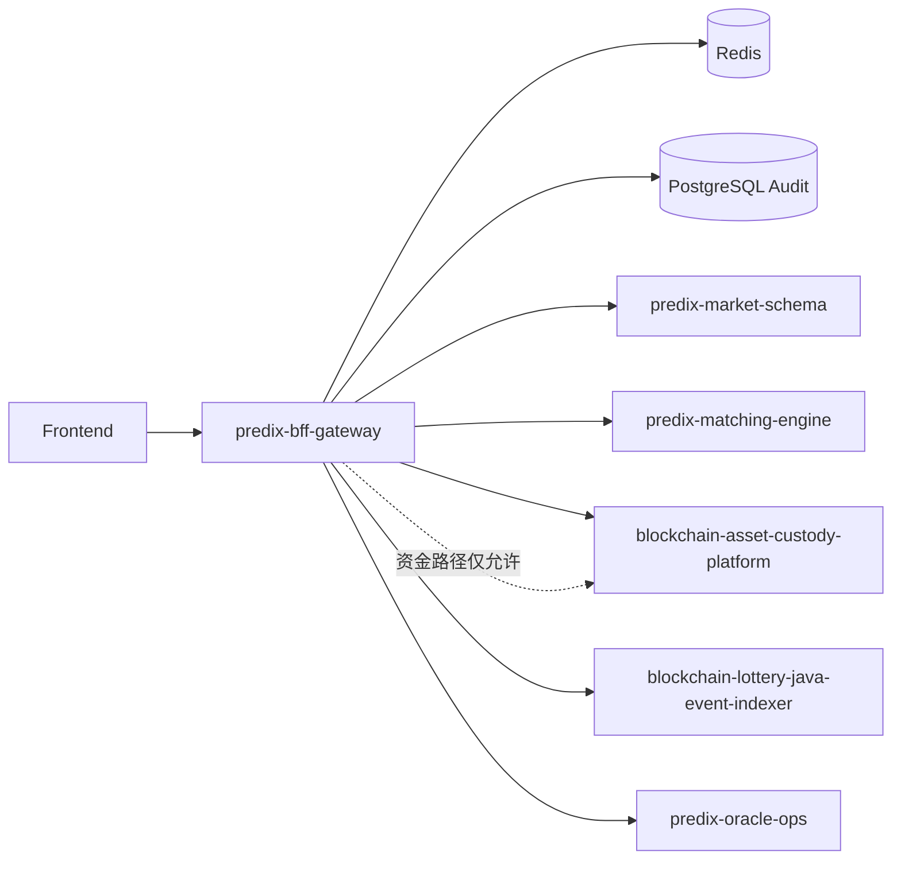

# predix-bff-gateway

PrediX 统一 BFF 网关：API 聚合、SIWE 钱包登录、合规地域策略、下游服务编排。

## 快速启动

### 前置

- JDK 21
- Maven 3.9+
- Docker（可选，用于 Redis / PostgreSQL）

### 本地运行

```bash
# 启动依赖
docker compose -f docker/docker-compose.yml up -d redis postgres

# 复制环境变量
cp .env.example .env

# 构建并运行
mvn spring-boot:run -Dspring-boot.run.profiles=dev
```

或使用脚本：

```bash
chmod +x scripts/start-local.sh
./scripts/start-local.sh
```

服务默认：`http://localhost:8080`  
Swagger UI：`http://localhost:8080/swagger-ui.html`  
健康检查：`http://localhost:8080/actuator/health`  
Prometheus：`http://localhost:8080/actuator/prometheus`

## 配置说明

| 变量 | 说明 |
|------|------|
| `REDIS_HOST` | 会话 / nonce / 限流 |
| `DATABASE_URL` | 审计日志 PostgreSQL |
| `JWT_SECRET` | JWT 签名密钥（生产必须轮换） |
| `MARKET_SCHEMA_URL` | predix-market-schema |
| `MATCHING_URL` | predix-matching-engine |
| `BACP_URL` | blockchain-asset-custody-platform |
| `INDEXER_URL` | blockchain-lottery-java-event-indexer |
| `ORACLE_OPS_URL` | predix-oracle-ops |
| `GEOIP_DB_PATH` | MaxMind GeoLite2 Country（中国大陆封禁） |

完整列表见 [.env.example](.env.example)。

## API 示例

### 1. 获取 SIWE nonce

```bash
curl -s http://localhost:8080/api/v1/auth/siwe/nonce | jq
```

### 2. 验证签名并登录

```bash
curl -s -X POST http://localhost:8080/api/v1/auth/siwe/verify \
  -H 'Content-Type: application/json' \
  -d '{
    "walletAddress": "0x...",
    "message": "...",
    "signature": "0x...",
    "chainId": 1
  }' | jq
```

### 3. 带 Token 访问

```bash
TOKEN="<accessToken>"
curl -s http://localhost:8080/api/v1/auth/me \
  -H "Authorization: Bearer $TOKEN" | jq
```

### 4. 市场列表

```bash
curl -s http://localhost:8080/api/v1/markets \
  -H "Authorization: Bearer $TOKEN" | jq
```

### 5. 资金入金（仅 BACP）

```bash
curl -s -X POST http://localhost:8080/api/v1/custody/deposits \
  -H "Authorization: Bearer $TOKEN" \
  -H 'Content-Type: application/json' \
  -d '{"userId":"u1","amount":"100","asset":"USDC"}' | jq
```

## 合规策略（中国大陆封禁）

- 从 `X-Forwarded-For` / `CF-Connecting-IP` / `X-Real-IP` 解析客户端 IP
- 使用 MaxMind GeoIP2（配置 `GEOIP_DB_PATH`）或内置 CN 启发式
- **中国大陆（CN）IP：100% 拒绝**，错误码 `COMPLIANCE_CN_BLOCKED`
- 交易类接口（`/api/v1/orders`、`/api/v1/custody`）需 `KYC=APPROVED`
- 国家优先级扩展：`SG > TH > MY > PH > VN > ID`（`predix.compliance.country-priority`）

## 依赖关系图



## 错误码表

| Code | HTTP | 说明 |
|------|------|------|
| `AUTH_INVALID_SIGNATURE` | 401 | SIWE 签名校验失败 |
| `AUTH_NONCE_EXPIRED` | 401 | nonce 过期或已使用 |
| `AUTH_INVALID_TOKEN` | 401 | Token 无效或会话失效 |
| `COMPLIANCE_CN_BLOCKED` | 403 | 中国大陆 IP 封禁 |
| `COMPLIANCE_KYC_REQUIRED` | 403 | 未通过 KYC |
| `DOWNSTREAM_TIMEOUT` | 504 | 下游超时 |
| `DOWNSTREAM_UNAVAILABLE` | 502 | 下游不可用 |
| `CUSTODY_PATH_VIOLATION` | 403 | 资金接口未走 BACP |
| `RATE_LIMIT_EXCEEDED` | 429 | 全局限流 |

## 测试

```bash
mvn verify
```

JaCoCo 行覆盖率门槛：≥ 75%。

## 文档

- [docs/architecture.md](docs/architecture.md)
- [docs/security.md](docs/security.md)
- [docs/compliance.md](docs/compliance.md)
